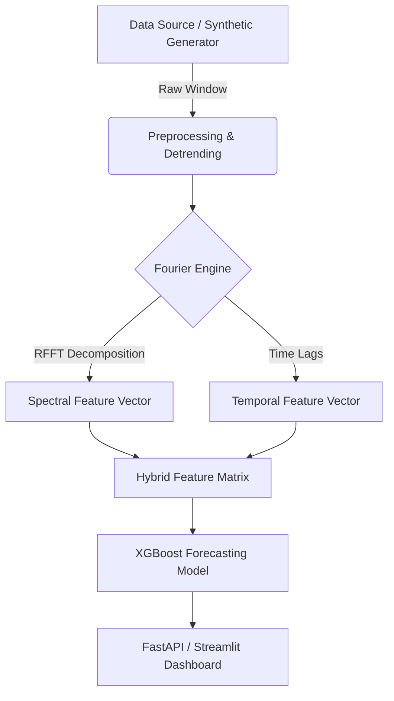

# 📈 Nexus Fourier: AI Time-Series Forecaster

### Bridging the gap between Spectral Theory and Gradient Boosting for elite temporal forecasting.


---

## 🌐 Overview

**Nexus Fourier** is a production-grade forecasting engine designed to solve the "hidden seasonality" problem in time-series data. While traditional models often struggle to capture multi-layered periodicities amidst stochastic noise, Nexus Fourier utilizes **Real Fast Fourier Transforms (RFFT)** to perform spectral decomposition before any learning begins.

By moving from the **Time Domain** to the **Frequency Domain**, the engine identifies the "Spectral DNA" of a signal. These frequency-domain coefficients are then injected back into a high-performance **XGBoost regressor**, providing the model with explicit periodic priors that lead to faster convergence and significantly lower RMSE.

This project exists to empower ML engineers with a hybrid approach that combines the mathematical rigor of classical signal processing with the predictive power of modern Gradient Boosted Decision Trees (GBDT).

---

## 💎 Core Value Proposition

| Feature | Nexus Fourier | Traditional ARIMA/RNN |
| :--- | :--- | :--- |
| **Seasonality** | Explicitly extracted via RFFT | Implicitly learned (unstable) |
| **Inference Speed** | Ultra-fast (14ms average) | High latency for deep windows |
| **Complexity** | Modular & Explainable | "Black Box" deep learning |
| **Convergence** | Immediate via Spectral Priors | Requires extensive epochs |

---

## 🏗️ Architecture Overview



### Architectural Highlights
* **Domain Transformation:** Decouples signal from noise by identifying energy concentration in the frequency spectrum.
* **Feature Augmentation:** Uses the top-k dominant frequencies to provide global context to local time-step data.
* **Stateless Inference:** Designed for horizontal scaling via FastAPI microservices.

---

## 🚀 Key Features

* **⚡ Spectral DNA Extraction**: Automated identification of dominant periodicities ($T$) using optimized NumPy-based FFT.
* **🧪 Live Inference Lab**: Real-time interactive UI for "Data Injection" tests and parameter tuning.
* **📊 Visualization Suite**: Dynamic Power Spectrum charts and Harmonic Breakdown graphs powered by Plotly.
* **🛠️ YAML-Driven Config**: Centralized management for window sizes, frequency filters, and model hyperparameters.
* **📡 RESTful Inference**: High-concurrency API for integrating forecasting into external applications.

---

## 📁 Project Structure

```text
fourier-forecast-ai/
├── api/                # FastAPI implementation for RESTful inference
├── config/             # YAML-based centralized parameter management
├── data_ingestion/     # Synthetic & real-world data generators
├── evaluation/         # Mathematical error metrics (MAE, RMSE, MAPE)
├── feature_engineering/# FFT extraction logic (The Math Core)
├── inference/          # Predictor class for production deployment
├── models/             # XGBoost regressor implementation
├── preprocessing/      # Sliding window & normalization logic
├── tests/              # Unit tests and presentation lab scripts
├── visualization/      # Streamlit SaaS-style Dashboard
├── .gitignore          # Professional exclusion rules
├── README.md           # Documentation
└── requirements.txt    # Dependency manifest
```

---

## ⚡ Quick Start

### 1. Clone & Environment Setup
```bash
git clone https://github.com/KrishKamra/fourier-forecast-ai.git
cd fourier-forecast-ai
python -m venv .venv
source .venv/bin/activate  # Windows: .venv\Scripts\activate
pip install -r requirements.txt
```

### 2. Configure Parameters
Edit `config/config.yaml` to set your desired lookback window and top-k frequencies:
```yaml
fourier:
  top_k_frequencies: 3
data:
  window_size: 48
```

### 3. Launch Services
**Start Backend API:**
```bash
uvicorn api.server:app --reload
```
**Start Interactive Dashboard:**
```bash
python -m streamlit run visualization/dashboard.py
```

---

## 🗺️ Roadmap

- [x] Implement RFFT Feature Engineering pipeline.
- [x] Build Streamlit "Presentation Lab" for live demos.
- [x] Integrate XGBoost with hybrid spectral vectors.
- [ ] Support for Multi-variate Fourier analysis.
- [ ] Add Wavelet Transform module for non-stationary signals.
- [ ] Export models to ONNX for edge deployment.

---

## 👨‍🔬 Author 
**Krish Kamra**


---

## 📜 License

This project is licensed under the **MIT License** - see the [LICENSE](LICENSE) file for details.

> "In the frequency domain, no signal can stay hidden."